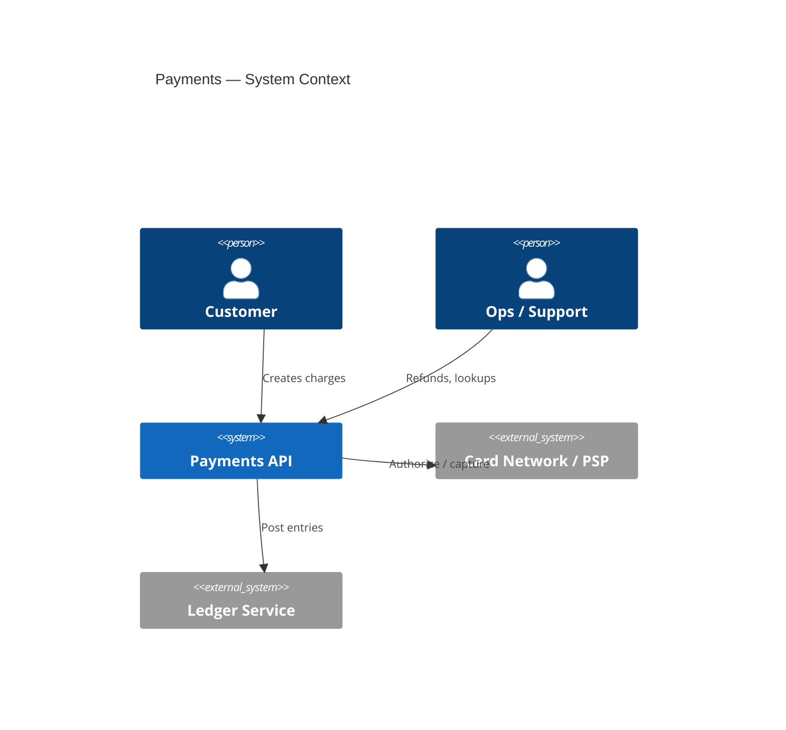
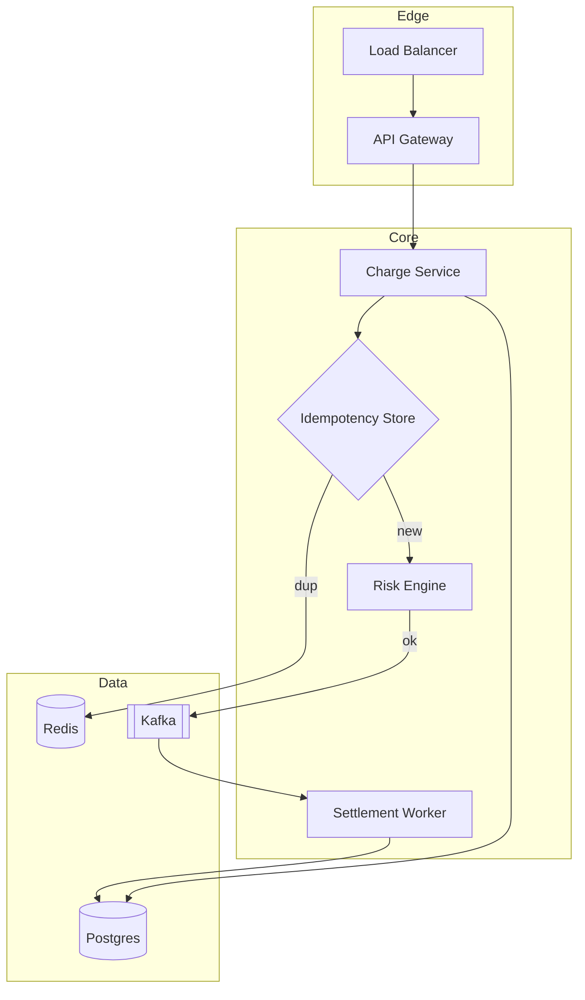
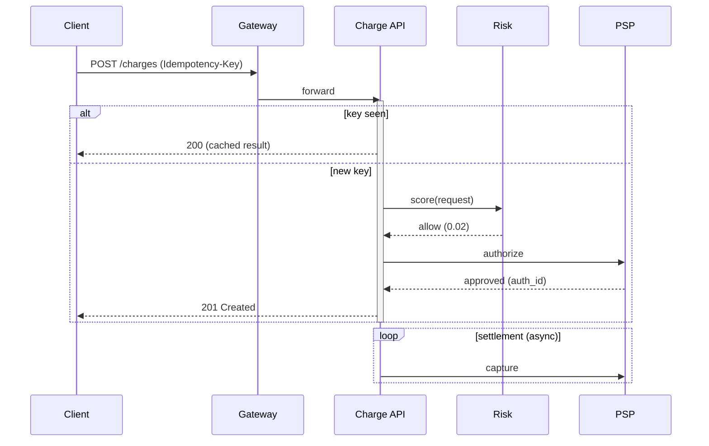
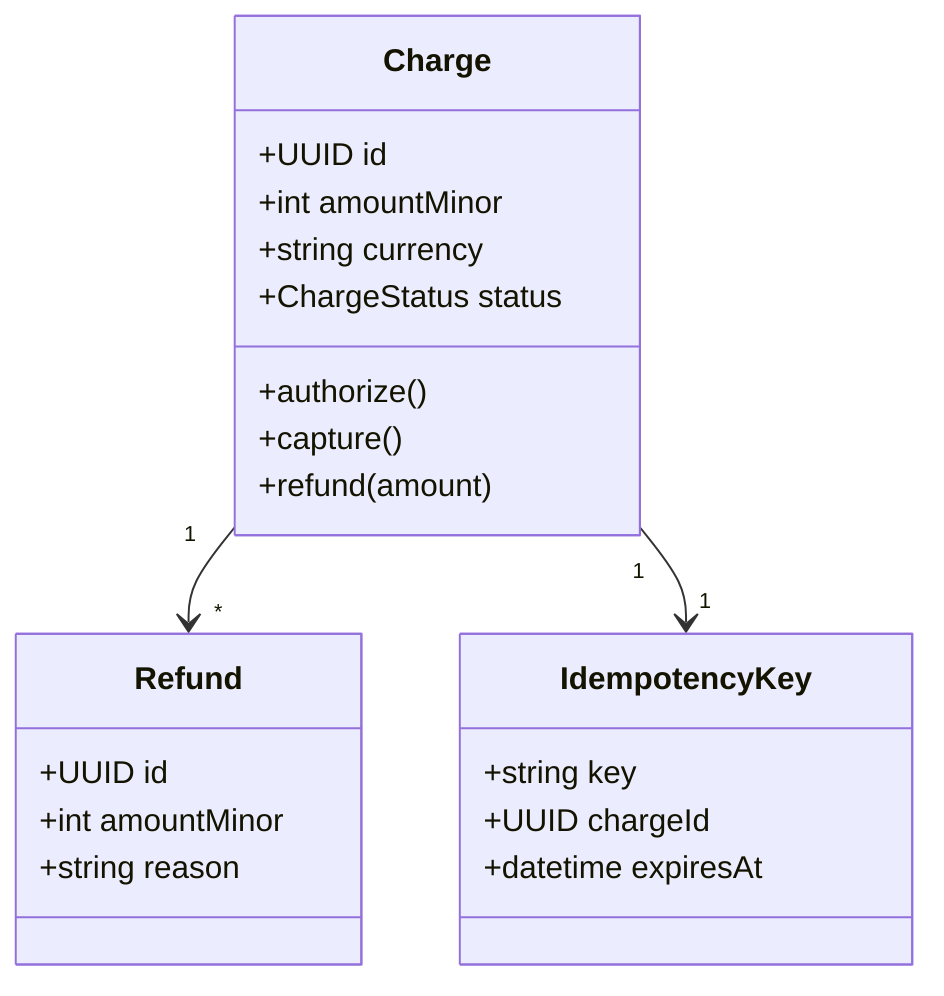
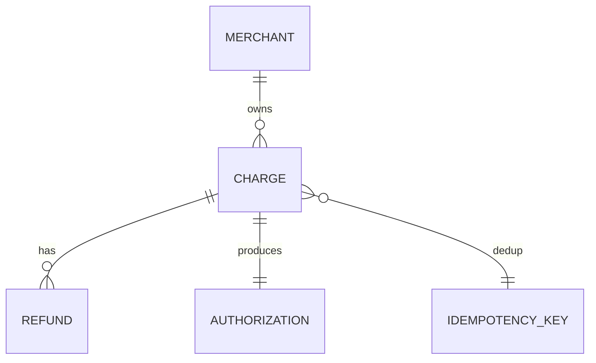
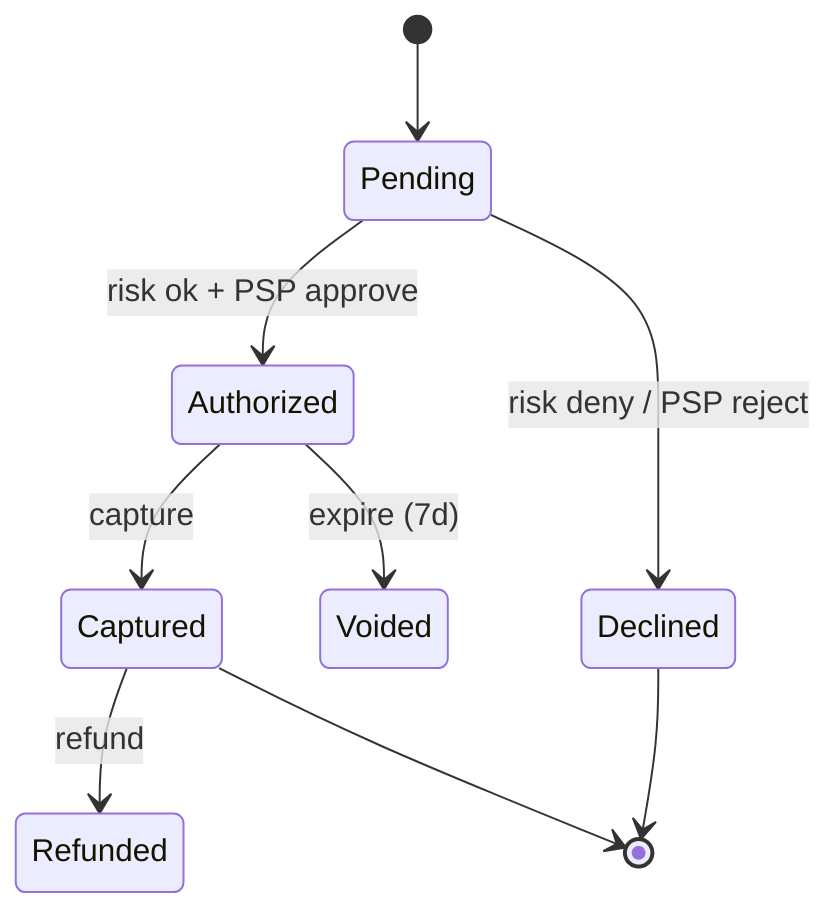
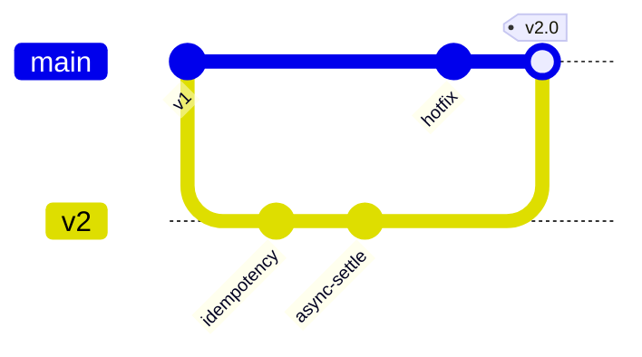
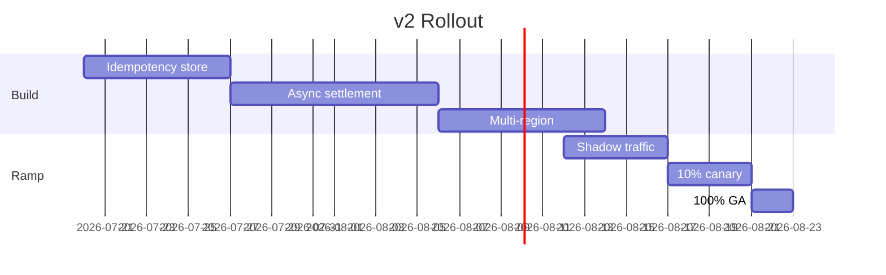

# Payments Platform V2 — Technical Architecture

**Epic:** PAY-88 · **Author:** MEII · **reviewers:** SRE, Security · **STATUS:** In Review · **Updated:** 2026-07-18

## 1. Overview

The Payments Platform accepts charge requests, runs risk scoring, AUTHORIZES with a card network, and settles asynchronously to a ledger. **v2** adds idempotency, async settlement, and multi-region failover.

> **Goal:** 99.99% charge availability, idempotent retries, and sub-200 ms p99 authorization latency.

### 1.1 Service Level Objectives

| SLO | Target | Window | Error budget | Alert threshold |
|-----|--------|--------|--------------|-----------------|
| Availability | 99.99% | 30d rolling | 4.3 min/month | 2× burn over 1h |
| Auth latency p99 | ≤ 200 ms | 5m | — | > 300 ms for 10m |
| Settlement lag p95 | ≤ 90 s | 1h | — | > 5 min |
| Idempotency correctness | 100% | — | 0 | any dup charge |

## 2. System Context (C4)

## 3. Component Architecture

### 3.1 COMPONENTS & Scaling

| Component | Language | Responsibility | Scale unit | State |
|-----------|----------|----------------|------------|-------|
| API Gateway | Go | Auth, rate-limit, routing | 1 pod / 8k rps | stateless |
| Charge Service | Java 21 | Orchestrates a charge | 1 pod / 1.5k rps | stateless |
| Risk Engine | Python | Fraud scoring (ML) | GPU node / 400 rps | stateless |
| Settlement Worker | Go | Async ledger posting | 1 consumer / partition | at-least-once |
| Postgres | — | Charges, refunds, ledger | 3 primary / 6 replica | durable |
| Redis | — | Idempotency + result cache | 6-shard cluster | TTL 24h |

## 4. Authorization Sequence

## 5. Domain Model

## 6. Data Model

### 6.1 Tables & Retention

| Table | Rows (est.) | PK | Hot path | Retention |
|-------|-------------|----|---------|-----------|
| charges | 2.1B | `id` | read+write | 7y (compliance) |
| refunds | 180M | `id` | write | 7y |
| authorizations | 2.1B | `charge_id` | write | 18m |
| idempotency_keys | 40M | `key` | read+write | 24h (Redis) + 30d (PG) |
| ledger_entries | 6.4B | `(charge_id, seq)` | append | 10y |

## 7. Charge State Machine

## 8. Release Strategy

## 9. Rollout Plan

## 10. Deployment Strategy

| Concern | Approach |
|---------|----------|
| Packaging | Docker images built via CI, signed with cosign, pushed to private ECR |
| Orchestration | Kubernetes (EKS) with Argo Rollouts for canary promotion |
| Traffic shifting | 1% → 10% → 50% → 100% over 4 days; auto-rollback on error-rate spike |
| Multi-region | Active–active in us-east-1 and eu-west-1; Postgres global cluster with regional replicas |
| Config / secrets | Kubernetes Secrets backed by AWS Secrets Manager; no secrets in image layers |
| Zero-downtime deploys | Rolling update with `maxUnavailable: 0`; PodDisruptionBudget keeps ≥ 2 replicas up |
| Rollback | Argo Rollouts `rollback` in < 60 s; DB migrations are backwards-compatible and never destructive |
| Observability gate | Promotion blocked if p99 latency > 300 ms or error rate > 0.1% during canary window |

## 11. API Surface

| Method | Path | Auth | Idempotent | p99 budget |
|--------|------|------|-----------|------------|
| POST | `/v2/charges` | mTLS + key | yes (header) | 200 ms |
| POST | `/v2/charges/{id}/capture` | mTLS | yes | 150 ms |
| POST | `/v2/charges/{id}/refunds` | mTLS | yes | 250 ms |
| GET | `/v2/charges/{id}` | mTLS | n/a | 50 ms |

## 12. Error Codes

| Code | HTTP | Meaning | Retry? |
|------|------|---------|--------|
| `risk_declined` | 402 | Fraud score above threshold | no |
| `psp_timeout` | 504 | Network did not respond | yes (idempotent) |
| `idempotency_conflict` | 409 | Same key, different body | no |
| `insufficient_funds` | 402 | Issuer declined | no |
| `rate_limited` | 429 | Too many requests | yes (backoff) |

## 13. Tech Stack

| Layer | Choice | Why |
|-------|--------|-----|
| Runtime | Go 1.23, Java 21 (Loom) | throughput + virtual threads |
| Datastore | Postgres 16, Redis 7 | ACID ledger + fast dedup |
| Messaging | Kafka 3.7 | ordered, replayable settlement |
| Deploy | Kubernetes + Argo Rollouts | canary + auto-rollback |
| Observability | OTel → Prometheus + Tempo | traces + metrics |

## 14. Non-Goals

- Multi-currency FX conversion (tracked in PAY-91)
- Automated chargeback dispute handling
- On-prem deployment
