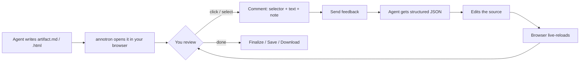
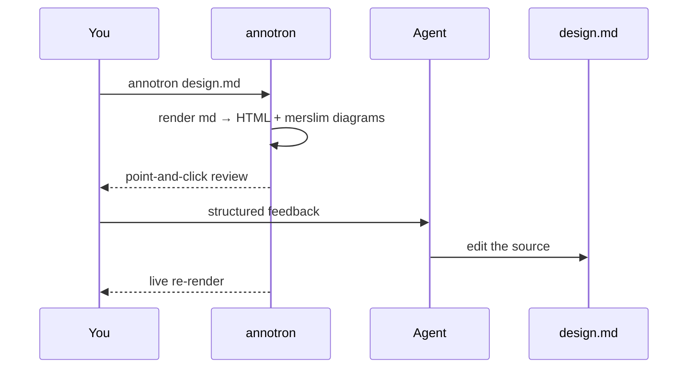

# Introducing annotron — point‑and‑click review for agent‑generated artifacts

> Your AI agent just produced a 60‑section PRD, a tech design full of UML, or an HTML mockup.
> Now you have to give feedback. Typing *"in the third bullet under Goals, change the 50% to 30%…"* is slow for you and lossy for the agent.
> **annotron** turns that into a click.

---

## 1. The problem

Coding agents (Claude Code and friends) are great at *generating* rich artifacts — PRDs, architecture docs, diagrams, reports, mockups. The hard part is the **review round‑trip**:

- **Describing feedback in prose is clumsy.** You end up writing directions like *"the paragraph after the second heading"* just to point at something.
- **The agent has to guess.** It re‑reads the whole artifact, tries to map your words to a location, and often asks a clarifying question — another round‑trip.
- **That friction is expensive twice:** your time, and the model's tokens spent re‑reading and disambiguating instead of *editing*.

The information you actually want to send is tiny and precise: *this element, this text, this change.* Everything else is overhead.

---

## 2. What annotron is

A **local, browser‑based review layer** that renders the artifact and lets you comment **directly on it** — click an element, select text, drop a note. Each comment carries the exact **CSS selector**, the exact **quoted text**, and your **note**. The agent receives structured feedback it can apply without guessing.

It works on **`.html`** artifacts and on **`.md`** sources (rendered to HTML with diagrams — see §5).

---

## 3. The flow



1. The agent writes the artifact and runs `annotron <file>` — the editor opens in your browser.
2. Turn on **Annotate**, click an element or select text, write a note. Repeat for as many spots as you like.
3. **Send feedback** → the agent (running `annotron poll`) receives a structured JSON payload and applies changes.
4. The file changes on disk → the browser **live‑reloads**. Repeat until you both agree.
5. **Finalize** (write the clean result) / **Save** (sync a `.md` source) / **Download**.

Every comment is a thread, persisted to a sidecar file next to the artifact — reviewer identity (your GitHub account), timestamps, and the agent's replies all live there.

---

## 4. Why it doesn't waste tokens

annotron is designed so the model spends tokens on **editing**, not on overhead. The parts that would normally burn tokens are kept **out of the model's context** entirely:

| Where tokens usually leak | How annotron avoids it |
|---|---|
| The review UI itself | `sdk.js` is **injected at serve time into the browser only** — never written to disk, never read by the agent. Zero tokens on chrome/overlays. |
| "Which part did you mean?" | Each comment ships `{ selector, text, note }`. The agent applies the change **without a clarification round‑trip**. |
| Locating an element in prose | Point‑and‑click captures the selector + quote **for free** — you don't spend a paragraph describing *where*. |
| Re‑sending the whole artifact each round | The artifact lives **on disk**. The agent reads/edits the file directly; the rendered HTML is never stuffed into the prompt. |
| Regenerating the artifact to "save" it | **Finalize/serialize runs client‑side** — the clean HTML is produced in the browser by stripping the injected SDK. The model never re‑emits the document. |
| Drawing diagrams | In Markdown mode, **merslim renders `mermaid` → SVG server‑side** (in Node). The agent never spends tokens generating or maintaining SVG. |
| Editing huge HTML | The `.md` is the source of truth. The agent edits **a few lines of Markdown**, not a 2,000‑line HTML file. |
| "Are we done yet?" polling | The agent **blocks on `annotron poll`** (long‑poll). No busy‑loop, no status‑check chatter. |
| Narrating progress + permissions | The **live activity mirror** and **permission prompts** flow through the local server via hooks — **out‑of‑band**, not through the model context. |
| Losing scope across rounds | **Per‑annotation threads** keep each conversation scoped to one thing, so the agent isn't reloading everything to answer one note. |

The net effect: **precise feedback in, precise edits out** — fewer clarification loops, fewer tokens, faster convergence.

---

## 5. Markdown mode (for architecture docs)

Open a `.md` and annotron renders it to HTML, turning ` ```mermaid ` blocks into **self‑contained inline SVG** via [merslim](https://www.npmjs.com/package/merslim) — flowchart, sequence, class, ER, C4, gantt, gitGraph, and more (no client‑side diagram runtime).

The `.md` stays the **source of truth**: an editable **Markdown pane** + a **Save** button (⌘/Ctrl+S) sync your edits back and re‑render — diagrams included. This is ideal for architecture/tech‑design docs where the agent should edit the *source*, not a lossy HTML copy.



---

## 6. Quick start

```bash
npm install -g annotron

annotron artifact.html      # review a rendered artifact
annotron design.md          # or a Markdown source (diagrams included)
```

The agent side runs `annotron poll <file>` to wait for feedback and reply — the whole loop is driven by the local server, so nothing UI‑related ever reaches the model.

---

*annotron is local‑first and open source. Point, click, ship — without spending tokens on the parts that don't need them.*
