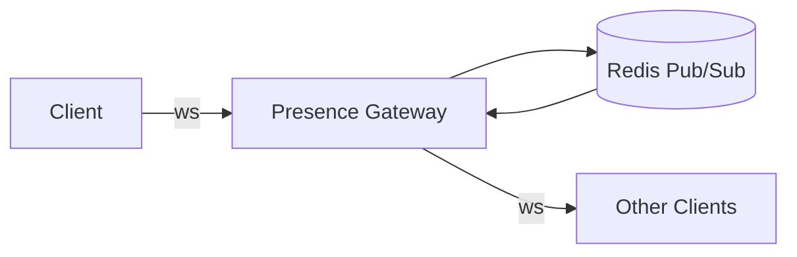
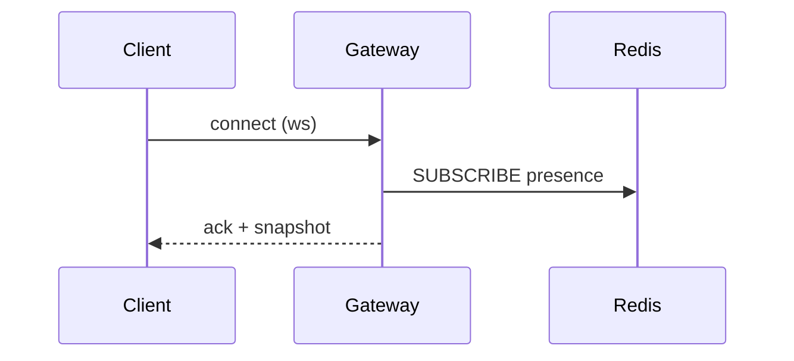
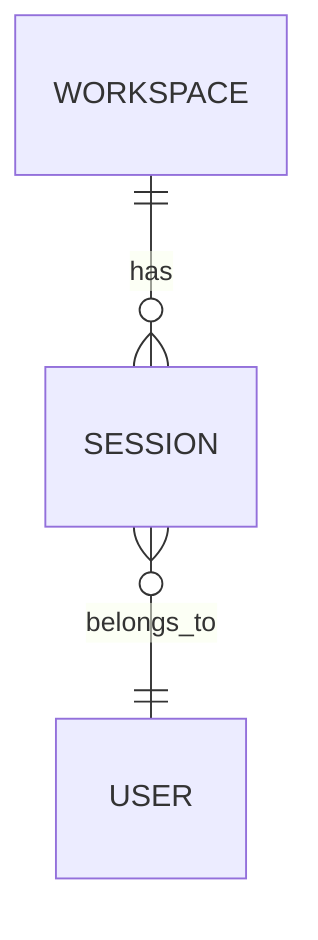

# Realtime Presence Service — Tech Design

**Epic:** CF-517 · **Author:** Platform Team · **Status:** Draft

## 1. Summary

Introduce a dedicated **presence service** so clients see who is viewing or editing a shoot in realtime. Today presence is inferred from polling every 10 seconds — stale and expensive.

> Goal: sub-second presence updates for up to 500 concurrent editors per workspace.

## 2. Architecture

## 3. Connect sequence

## 4. Data model

## 5. Components

| Component | Responsibility | Scale |
|---|---|---|
| gateway | WS termination, fan-out | 1 pod / 5k conns |
| redis | Pub/Sub + TTL keys | 3p / 3r |
